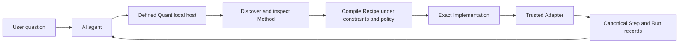

# Defined Quant

Defined Quant is an open-source, local-first computation layer between AI agents and quantitative
data and calculation systems. It helps an agent discover the relevant financial method, validate
material conventions, run a supported implementation, and return a structured result that can be
inspected separately from the agent's explanation.

The agent still understands the user's problem and writes the analysis. Defined Quant supplies a
structured calculation boundary: compact discovery, explicit inputs and defaults, controlled
execution, and records of what was calculated. This avoids loading an entire calculation catalog
into the model's context and keeps financial logic out of prompts.

> **Experimental Technical Preview**
>
> The local host and bundled catalog are pre-release. The seven bundled native implementations
> have lifecycle `draft`, author-asserted numerical evidence, and no independent domain review.
> They are not certified models, production prices, or investment advice. Engineering checks,
> numerical evidence, provenance, provider authentication, and domain review remain separate
> claims.

## How it works



This is the canonical path for all seven bundled Methods. Their recipes bind to nine atomic
Capabilities and, under an explicit host policy and availability snapshot, to nine exact DQ-native
Implementations. Simple Return remains the reference example: `dq.market_data.simple_return`
binds `returns.simple` to `dq_native.simple_return`. Provider-backed execution is not shipped.

A typical agent workflow is:

1. Search compact contract metadata using the user's intent, available inputs, and desired output.
2. Inspect only the most relevant method contracts and their limitations.
3. Ask for any missing choice that could change the answer instead of guessing it.
4. Carry any explicit implementation, backend, transport, locality, network, or fallback preference
   as a bounded resolution constraint without inventing one.
5. Compile one exact implementation per capability under policy, trust, and explicit availability.
6. Execute only that compiled binding through a trusted adapter and publish immutable step and run
   records.
7. Let the agent explain the records without silently redefining the calculation.

If no supported method matches, Defined Quant should refuse visibly rather than substitute a
plausible calculation.

## Methods and implementations

Defined Quant separates the financial specification from the system that performs it:

- A **method** defines the calculation's financial meaning: inputs, outputs, conventions,
  constraints, assumptions, limitations, interpretation, and backend-neutral recipe.
- A **capability** is one atomic backend-neutral typed operation referenced by a recipe step.
- A **backend** is a local runtime, library, data provider, analytics service, HTTP API, database,
  or external MCP system with declared operational boundaries.
- An **implementation** is one exact registered realization of one capability using declared
  backends.
- An **adapter** maps Defined Quant's canonical contract to a particular implementation and maps
  its result back into the canonical output.
- A **provider** is an external data or analytics system. It is not itself a method.
- A **component** is a website presentation term and temporary compatibility name for the old
  bundled format; it is not the core storage or execution abstraction.

All seven bundled calculations now use this model end to end: separate Method, Capability,
Backend, Adapter, and Implementation records, a pure preference-aware compiler, exact
trusted-adapter execution, and complete records. Installation alone is not trust. The host must explicitly admit the
implementation under policy, satisfy required trust dimensions, observe exact availability, and
verify the installed adapter artifact before loading its entry point. The adapter may not select a
replacement or apply fallback.

No production OpenBB, LSEG, statsmodels, QuantLib, database, HTTP, or external-MCP implementation is
registered yet. Those names describe different backend kinds and will not be advertised until an
actual independently installable adapter and its evidence exist.

## Local MCP alpha

The current host is a Python local STDIO MCP server. In MCP terms, the AI application is the client
and Defined Quant is the local server. Catalog, planning, dataset, and execution operations dispatch
through the transport-neutral `DefinedQuantService`.

Today the server can:

- search and inspect the canonical Method registry without importing adapters;
- compile automatic-resolution proposals under host policy and explicit availability, and validate
  closed implementation/provider preferences without treating an agent assertion as trusted origin;
- execute only an exact retained compiled plan through the trusted DQ-native adapters and return
  immutable Plan, Step, and Run records;
- register and preview supported caller-supplied datasets;
- retrieve plans, runs, datasets, and bounded artifacts; and
- use explicitly named component compatibility operations only during their time-bounded removal
  window.

The canonical public direction is `search_methods`, `inspect_method`, `compile_plan`,
`execute_plan`, `get_plan`, `get_run`, `get_dataset`, and `read_artifact`. Compatibility operations
are migration aliases with a deletion milestone, not a parallel permanent runtime.

The current MCP surface does not mint trusted user-origin receipts. A proposal containing an
explicit implementation or provider preference therefore stops with `needs_information` until a
future host confirmation flow verifies that origin; it never upgrades the agent's assertion.

From a source checkout, install the two locked development environments and start the server:

```text
uv sync --locked
uv sync --project mcp_server --locked
uv run --project mcp_server defined-quant-mcp
```

The alpha targets Windows, macOS, and Linux. It is not advertised as release-supported until the
same exact core and MCP wheel pair passes the required native matrix on Python 3.11 and 3.13. See
[`mcp_server/README.md`](mcp_server/README.md) for development launch settings, privacy, installation,
and platform details, and [`docs/LOCAL_MCP_ALPHA_DESIGN.md`](docs/LOCAL_MCP_ALPHA_DESIGN.md) for the
full transport contract.

### Current data inputs

Current dataset registration accepts inline rows, inline JSON, and local CSV or JSON files beneath
explicitly configured data roots. Literal values may also be supplied directly to an operation.

Excel workbooks, provider or HTTP API ingestion, databases and SQL Server, and external MCP data
sources are not supported by the current runtime. They are intended adapter or ingestion paths and
should not be treated as available until a concrete implementation is registered and tested.

### Example requests

For a small inline calculation, a user can ask:

> Calculate simple returns for adjusted prices 100, 103, 101, and 105 on these four dates.

The agent searches the catalog, inspects the selected contract, confirms that the supplied price
kind and timestamps satisfy it, compiles the Method under host policy, and executes the exact
selected DQ-native Implementation.

For a local file, a user can ask:

> Use `prices.csv` from the configured data root and calculate simple returns from its adjusted
> prices and timestamps.

The server must already have been launched with that directory as a configured data root. The
legacy component compatibility path registers and normalizes the CSV, exposes a bounded preview for
field mapping, and records the dataset reference used by the operation. A prompt cannot grant access
to another directory. Dataset-to-Method recipe binding is not yet part of the canonical
methods-first runtime.

## Canonical registry and migration catalog

Start in [`registry/`](registry/). It separately authors methods, capabilities, backends, adapters,
implementations, conformance, and evidence. All seven Methods have complete canonical execution
slices backed by nine tested DQ-native Implementations. Category is taxonomy metadata rather than
a code hierarchy.

The preview also retains seven legacy DQ-native component folders as migration input:

```text
categories/
├── market_data/
│   ├── log_return/
│   ├── monthly_return_matrix/
│   ├── rebased_price_index/
│   └── simple_return/
├── performance/
│   └── drawdown/
└── volatility/
    ├── historical_volatility/
    └── rolling_historical_volatility/
```

Every legacy component has the same five visible files: `component.py`, `contract.yaml`,
`evidence.yaml`, `test_component.py`, and `README.md`. Those folders now serve only as compatibility
inputs and preserved-behavior fixtures; they are not a source of truth and are not used for new
backends.

## Legacy direct Python example

The compatibility package can still call a native component directly. This bypasses Method
discovery, implementation resolution, trusted-adapter checks, and Run records and is not the
canonical integration path.

```bash
uv sync --locked
uv run python - <<'PY'
from defined_quant.market_data.simple_return.component import simple_return

result = simple_return(
    prices=[100, 103, 101, 105],
    price_kind="adjusted",
    timestamps=[
        "2026-07-20T00:00:00Z",
        "2026-07-21T00:00:00Z",
        "2026-07-22T00:00:00Z",
        "2026-07-23T00:00:00Z",
    ],
)
print(result.returns)
PY
```

The result is a typed object rather than a bare number. It includes units, assumptions,
disclosures, state-dependent warnings, datapoint derivations, provenance, and a renderer-neutral
visualization specification. The shared renderer can turn that specification into deterministic
SVG without adding a plotting-library dependency.

## Trust model

Defined Quant does not turn “the code ran” into a blanket claim that a financial conclusion is
correct. It keeps these dimensions separate:

- the financial method and its declared conventions;
- the selected implementation and adapter or provider identity;
- input provenance and provider authentication;
- schema and constraint validation;
- executable numerical evidence and test history;
- operation-record integrity; and
- independent domain review.

For a migrated calculation, `method.yaml` owns financial meaning and the user-facing contract;
`capability.yaml` owns the atomic interface; `conformance.yaml` owns universal known answers and
boundaries; and Backend, Adapter, and Implementation records own their exact operational concerns.
Capability-owned Method fields are expanded by reference and recorded as schema bindings rather
than hand-copied into both schemas.

For each retained legacy direct component path, Pydantic `Inputs` and `Output` models remain
canonical only within that compatibility runtime. `contract.yaml` defines its identity, scope,
discovery metadata, guidance, and limitations, and `evidence.yaml` binds fixtures to the exact
legacy behavior hash.

A canonical run separately binds Method, Capability, Backend, Adapter, Implementation, policy,
availability, artifact, compiled Plan, Step, and complete Run identities. It records candidate
rejections and exact preference/fallback decisions. That establishes what was selected and
executed; it does not prove that caller-supplied data is authentic, that the Method is suitable,
that a provider's claims are correct, or that an independent party reproduced the run.

Anything that can change the answer must be supplied, visibly defaulted, or refused. Remote
implementations and external sources must disclose their network, credential, provenance, and
attestation boundaries before they can support stronger claims.

See [`VALIDATION.md`](VALIDATION.md) for the exact meaning and limits of each trust claim.

## Repository and contributing

```text
components/
├── registry/               canonical methods-first metadata and contracts
├── adapters/               independently installable trusted adapter distributions
├── categories/             migration-only native components
├── shared/                 registry, planning, execution, records, workers, and services
├── protocol/               canonical registry, resolution, execution, and legacy records
├── mcp_server/             optional local STDIO MCP transport distribution
├── authoring/              registry bundle, export, validation, release, and CI tools
├── tests/                  methods-first conformance, adapter, registry, and product tests
├── docs/                   durable technical designs and normative fixtures
├── .agents/                optional repository-wide agent integration
└── .github/                contribution and CI configuration
```

Packaging projects `categories/` and `shared/` into the public `defined_quant` namespace. The core
wheel also installs the separately versioned `defined_quant_protocol` namespace. The optional
`defined-quant-mcp` distribution owns the production MCP SDK dependency and transport boundary;
the core runtime continues to depend only on Pydantic. See [`ARCHITECTURE.md`](ARCHITECTURE.md) for
the complete package and runtime design.

Canonical methods-first repository checks are:

```bash
uv run pytest
uv run python authoring/export_component_pages.py
```

Legacy component compatibility checks are kept separate and do not discover or execute canonical
Methods:

```bash
uv run python authoring/check_component.py
uv run python authoring/search_catalog.py "calculate returns from prices"
uv run python authoring/export_catalog.py
```

Do not add another five-file native component. Author or extend the separate Method, Capability,
Backend, Adapter, Implementation, conformance, and evidence records through the full compilation,
execution, record, and website-projection path instead.
See [`ARCHITECTURE.md`](ARCHITECTURE.md) and [`CONTRIBUTING.md`](CONTRIBUTING.md). The optional
[methods-first agent skill](.agents/skills/use-defined-quant/SKILL.md) uses canonical Method
discovery, governed plan compilation and execution, and bounded record retrieval. Its old
component-oriented helper scripts remain explicit legacy compatibility checks only.

## Licence

Code is Apache-2.0. Component explanations, documentation, and visuals are CC BY 4.0. The Defined
Quant and Defined Flow names and visual identity are not granted by those licences; see
[`TRADEMARKS.md`](TRADEMARKS.md).
